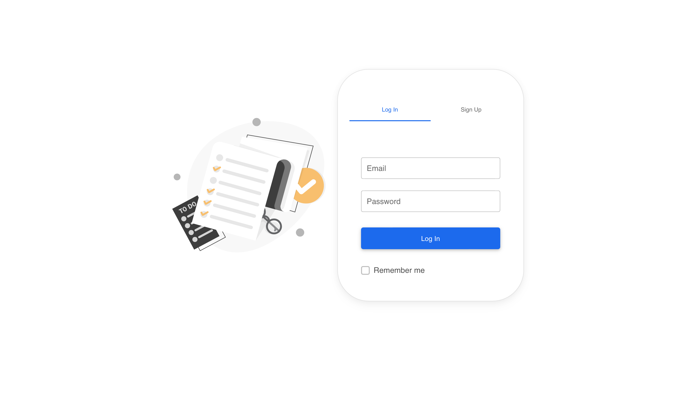
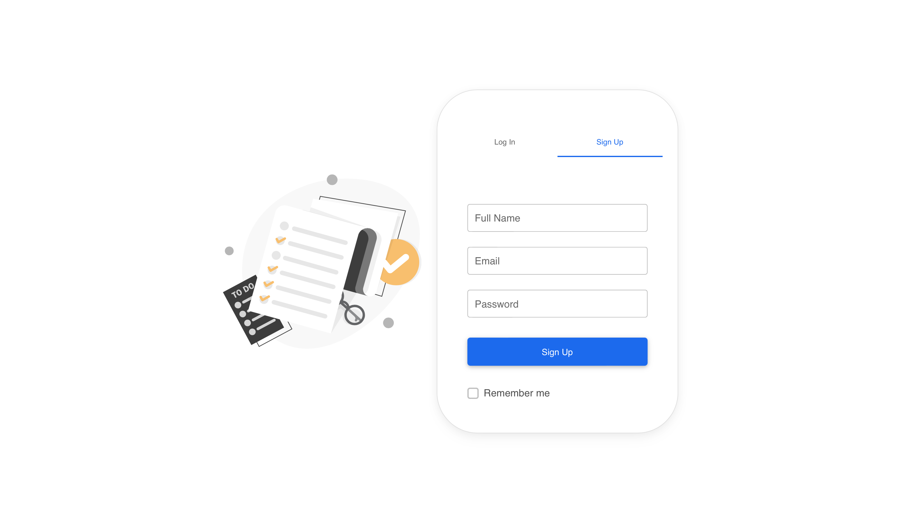
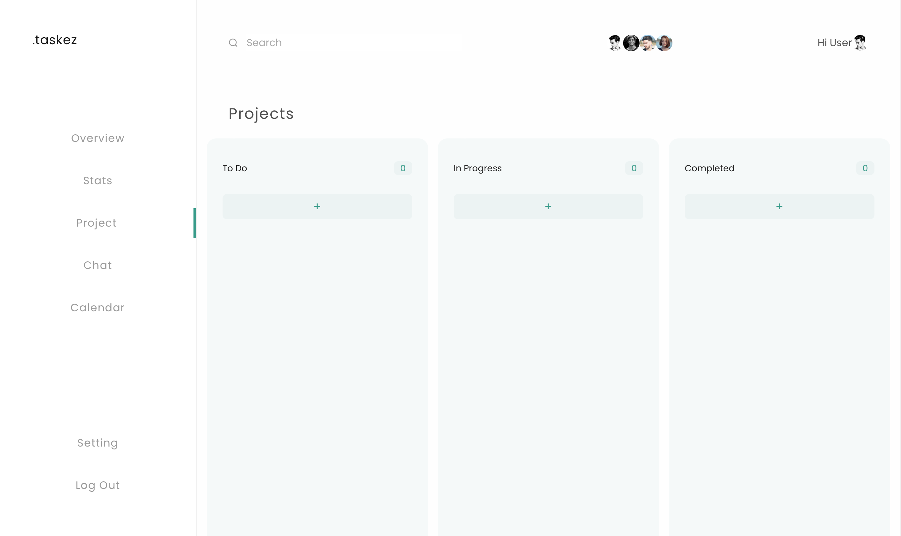
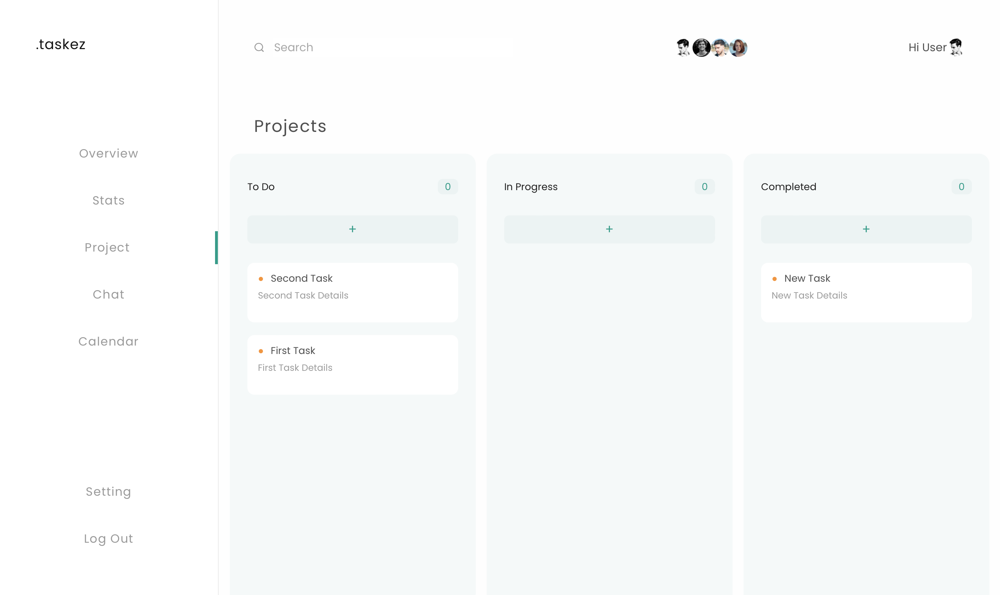

# .taskez

An app made with React to manage your tasks. This app was made solely for a challenge to myself to learn React and to complete the assignment within 3 days.

## Project Status
- [X] Basic UI of the login screen and the home screen using MDB UI Kit.
- [X] Basic functionality of adding tasks into the list using States and Hooks.
- [X] Basic movement between pages using React Router.

---
## Project Screen Shots

## Installation and Setup Instructions

Clone down this repository. You will need `node` and `npm` installed globally on your machine.  

Installation:

`npm install`  

To Start Server:

`npm start`  

To Visit App:

`localhost:3000`  

## Navigating the app:
- The first page you will see is the login page. 
- You can either view the login or signup options by selecting the corresponding tab.
- Authentication and Verification is not yet implemented.
- Clicking on "Log In" or "Sign Up" Button will take you to the home screen.
- You can add tasks by clicking on the "+" button on any of the three columns.
- A pop up will appear where you can enter the name and task details.
- You should see the task appear in the corresponding column.
- Drag and drop functionality is not yet implemented.
- Clicking on the Log Out button will take you back to the login page.

## Reflection

This was a 3-day long project built as a part of the FrontEnd Founding Engineer Role interview of [YouShd](https://www.youshd.com/). The project design was shared as a figma file. Project goals included making the frontend of a To-Do app built using React. 

Originally I wanted to build an app and host it on the internet that allowed users to efficiently manage their everyday task using a Kan-ban board style User-Interface. I started this process by using the `create-react-app` boilerplate.  

The main challenge of the this project was that I was a complete beginner in React and I had to learn it from scratch. I had to learn the basics of React and then learn how to use React Router and MDB UI Kit. I also had to learn how to use React Hooks to manage the state of the app. I had to learn all of this in 3 days. I was able to complete only the UI and skeletal functionalities of the project within 3 days and I learned a lot about React in the process.

I chose to use the `create-react-app` boilerplate to minimize initial setup and invest more time in diving into weird technological rabbit holes. In the next iteration I plan on making the app interactive and functional for users with at least some basic functionalities. 